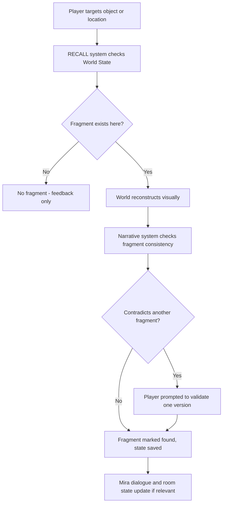

# Architecture — ECHO//ZERO Vertical Slice

This covers only what the vertical slice needs. It grows deliberately, one ADR at a time, as the project does — see `DECISIONS.md` for why it's shaped this way.

## Folders

- `Core/` — bootstrap, scene loading, save/load (ADR-0002)
- `Gameplay/` — player controller, the RECALL ability, the Drift encounter
- `World/` — Aerie scene content, memory-formation shader and logic
- `Narrative/` — Mira's dialogue, fragment data (as ScriptableObjects)
- `UI/` — HUD, dialogue UI, settings

Full reasoning in ADR-0003.

## How RECALL actually flows

This is the one path that matters right now — the puzzle, the meaningful choice, and Mira's reactions all run through it. The Drift encounter reuses the same RECALL → World State path, with "stabilize" instead of "reconstruct" as the resolution, rather than needing a separate combat system.

## What's deliberately not here yet

No AI/agent layer, no simulation layer separate from gameplay, no telemetry pipeline, no evaluation framework, no networking, no security boundary beyond basic save-file validation. Not oversights — they get added in later phases, if and when there's a real system for them to attach to. Adding them now would be architecture for a game that doesn't exist yet.

## Performance targets

Target hardware: RTX 4060 Laptop (8GB VRAM), 16GB system RAM, NVMe SSD. Concrete budgets (draw calls, texture memory, triangle counts) get set once there's a first playable pass to actually profile — that's the Polish & Evaluate phase, not this one. Right now the operative rule is simpler: nothing loads that isn't near the player.
